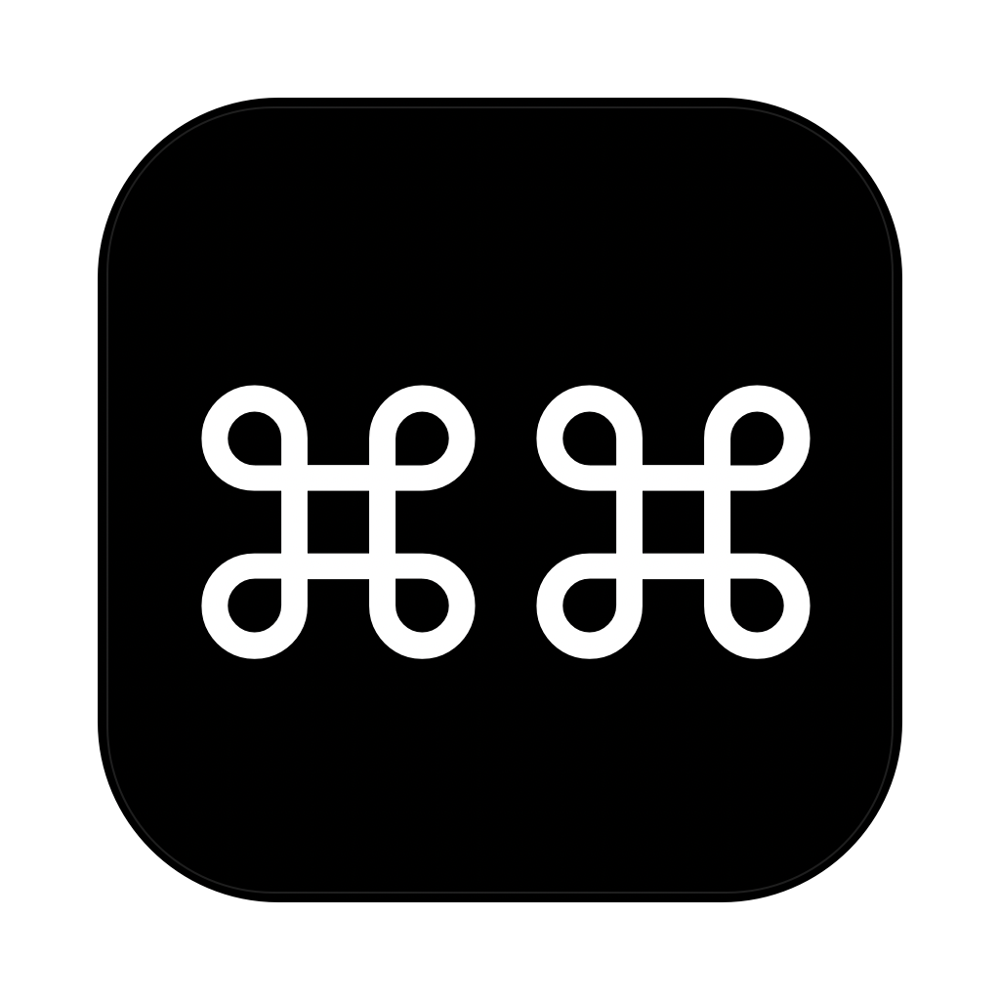

<p align="center">
  
</p>

# cmdcmd

A keyboard-first window switcher for macOS. Press both ⌘ keys at once to fan every visible window out into a grid of live previews, then jump straight to the one you want.

Requires macOS 14+.

## Trigger

**⌘ + ⌘** — tap left and right Command at the same time (no other key in between). Tap again, or press `esc`, to dismiss.

## Keybindings (overlay)

| Key | Action |
|---|---|
| arrow keys / `wasd` | Move selection |
| `1`–`9` | Pick that tile |
| `return` | Pick selected tile |
| `space` (hold) | Peek (zoom selected tile while held) |
| click / drag | Pick or drag-to-reorder |
| ⌘ + arrow | Swap selected tile with neighbour in that direction |
| ⌘W | Close selected window |
| ⌘`delete` | Ignore / un-ignore selected window |
| ⌘Y | Toggle "show hidden" view |
| ⌥`g`/`b`/`r`/`y`/`o`/`p` | Tag selected tile (green/blue/red/yellow/orange/purple) |
| ⌥`0` | Clear tag on selected tile |
| `esc` | Dismiss overlay |

Tile order and ignored windows persist per display via `UserDefaults`. Idle windows (no draw activity for ~2.5s) get a subtle indicator dot. The "show hidden" view displays every window — ignored ones at reduced opacity — so you can un-ignore them.

### Config file

Right-click the `⌘ ⌘` Dock icon and pick **Open Config…** — that creates `~/Library/Application Support/cmdcmd/config.json` (if missing) and opens it in your default editor. Loaded at app launch; restart after edits.

```json
{
  "animations": true,
  "trigger": "cmd-cmd",
  "bindings": {
    "h": "move-left",
    "j": "move-down",
    "k": "move-up",
    "l": "move-right",
    "cmd+x": "close"
  }
}
```

`animations: false` skips the show / pick zoom transitions.

`trigger` chooses what summons the overlay. Default `"cmd-cmd"` is the both-Command-keys chord. Anything else is treated as a regular hotkey spec — e.g. `"cmd+shift+space"` or `"f13"` (uses the same shortcut grammar as `bindings`). Hotkeys other than the chord require Accessibility permission to be globally observable.

Binding spec — modifier tokens: `cmd`, `shift`, `opt` (or `option`/`alt`), `ctrl`. Special keys: `esc`, `space`, `return`, `delete`, `left`, `right`, `up`, `down`. Anything else is a single character.

Actions: `pick`, `dismiss`, `move-left|right|up|down`, `swap-left|right|up|down`, `pick-1` … `pick-9`, `ignore`, `toggle-hidden`, `close`, `tag-green|blue|red|yellow|orange|purple|clear`.

## Build

```sh
./build-app.sh           # debug build → cmdcmd.app
./build-app.sh release   # release build
open cmdcmd.app
```

Or run the binary directly:

```sh
swift build
.build/debug/cmdcmd
```

## Permissions

On first launch you'll see an onboarding window explaining what the app needs and why:

- **Screen Recording** — for live tile previews (ScreenCaptureKit).
- **Accessibility** — for the ⌘⌘ chord listener and to raise / forward keys to the chosen window.

Each row has a Grant button that opens the matching pane in System Settings. Click Continue once both are toggled on. Both are required; the app does nothing without them.

The app shows in the Dock as `⌘ ⌘`. Right-click it for **Open Config…** (or quit it the normal way).

## Layout

```
Sources/cmdcmd/
  main.swift          # entry point, AppDelegate (Dock menu), trigger wiring
  AppIcon.swift       # ⌘⌘ glyph icon, also writes the iconset for make-icon.sh
  Onboarding.swift    # first-run permission window
  Overlay.swift       # overlay window, tile grid, selection, animations
  OverlayView.swift   # NSWindow + NSView event router for the overlay
  HintPill.swift      # bottom-center mode-hint label
  Config.swift        # JSON config loader (animations, trigger, bindings)
  Keymap.swift        # default shortcuts + override resolver
  HotkeyMonitor.swift # global hotkey trigger (alternative to CmdChord)
  Tile.swift          # per-window SCStream preview layer
  GridLayout.swift    # grid sizing for N tiles at the screen aspect ratio
  CmdChord.swift      # left+right Command chord detector
  SpaceTracker.swift  # private CGS/SkyLight space + window enumeration
  Log.swift           # stderr logger
Resources/             # Info.plist + AppIcon.icns + AppIcon.png
build-app.sh           # swift build → .app bundle + ad-hoc codesign
make-icon.sh           # regenerate Resources/AppIcon.icns + .png
```

## Status

Pre-release.
